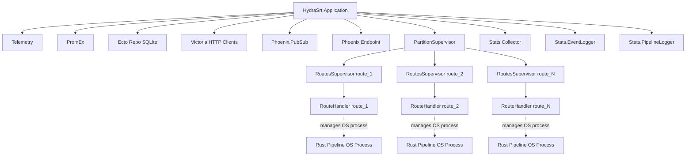

# HydraSRT Architecture

## Overview

HydraSRT has three runtime layers:

1. **Elixir/OTP** - route supervision, route state, configuration, REST API, WebSocket updates.
2. **Rust + GStreamer** - native media pipelines, one OS process per running route.
3. **React + Vite** - web UI.

## Control Plane

The Elixir layer owns route lifecycle and state:

- Each active route has a `RoutesSupervisor`.
- Each `RoutesSupervisor` starts one `RouteHandler`.
- `RouteHandler` is a `:gen_statem` process that starts, monitors, restarts, and stops the native pipeline process.
- Route configuration and runtime state are stored in SQLite.
- Status changes, metrics, and logs are published through Phoenix/PubSub and exposed by the API/UI.

## Media Plane

Each route's media work runs outside the BEAM:

- The native binary is built from `native/` into `priv/native/hydra_srt_pipeline`.
- Elixir starts it as an Erlang Port / OS process.
- GStreamer handles stream processing.
- A native crash affects the route process that owns that pipeline, not the whole BEAM VM.

### Source types and resolution

The public endpoint schema and the native pipeline kind are intentionally separate.
YouTube sources are stored and exposed by the REST API as `schema: "YOUTUBE"`, with
their canonical watch URL and selected media metadata. The Elixir resolver
(`HydraSrt.Youtube`) resolves that URL to a temporary HLS playlist before a native
process starts; the bearer playlist URL is never persisted in SQLite or returned by
the inspection API.

The native process receives only the generic HLS representation: `kind: "hls"` and
an already-resolved playlist URI. It does not know about YouTube. This lets the
native adapter use the same MPEG-TS program branches for HLS input while keeping
YouTube-specific URL resolution, refresh, cookies, and error handling in the
Elixir control plane.

## Process Architecture

### Supervision Tree



### Supervision Strategy

- **`HydraSrt.Application`**: root supervisor, `:one_for_one`.
- **`PartitionSupervisor`**: starts dynamic route supervisors.
- **`HydraSrt.RoutesSupervisor`**: one supervisor per active route.
- **`HydraSrt.RouteHandler`**: route state machine; owns one native pipeline process.

### Route Lifecycle

1. User enables a route via UI/API.
2. `HydraSrt.start_route/1` is called
3. `PartitionSupervisor` starts a `RoutesSupervisor`.
4. `RoutesSupervisor` starts a `RouteHandler`.
5. `RouteHandler` starts the Rust pipeline as an OS process.
6. `RouteHandler` reads pipeline stdout/stderr and monitors process exit.
7. On pipeline failure, `RouteHandler` restarts or switches source depending on route state.
8. User disables the route; `RouteHandler` terminates the pipeline.

## Inter-Process Communication

### Elixir <-> Rust Pipeline

Communication uses Erlang Ports:

- **Start/config**: Elixir starts the pipeline with command-line arguments.
- **Logs/status**: the pipeline writes structured lines to stdout/stderr; `RouteHandler` parses them.
- **Exit**: `RouteHandler` receives port exit events.

The native pipeline remains a standalone binary. It does not run inside the BEAM.

### Native Process Boundary

Media processing runs outside the BEAM. A native crash should terminate the route pipeline process, not the Elixir VM.

## Data Layer

### SQLite (Ecto)

**Purpose**: Configuration state and operational data.

Used for:
- Route definitions (sources, destinations, SRT parameters, RTP-over-UDP source options)
- RTP sources expect MPEG-TS over RTP (MP2T payload via `rtpmp2tdepay`)
- User authentication and sessions
- Route enable/disable state
- Active source tracking (for failover)

Storage notes:
- Single file.
- No external database service.
- ACID transactions for configuration changes.

**Location**: `DATABASE_PATH` env var, default `hydra_srt.db`

### VictoriaMetrics and VictoriaLogs

**Purpose**: Historical observability storage outside the BEAM runtime.

Used for:
- System metrics history
- Network interface statistics
- Route performance metrics
- Route events and status history
- Pipeline logs history

Storage notes:
- VictoriaMetrics stores numeric time-series data and route events.
- VictoriaLogs stores structured pipeline log lines.
- Both services are external HTTP processes, so storage failures degrade analytics without crashing HydraSRT.

**Location**: `VICTORIA_METRICS_URL` and `VICTORIA_LOGS_URL`, defaulting to loopback services in local deployments.

## Metrics Collection and Export

HydraSRT exposes current metrics through Prometheus and writes historical metrics to VictoriaMetrics. Pipeline logs are written to VictoriaLogs.

### Collection Path

```mermaid
flowchart LR
    OsMon[OsMon Plugin] -->|emits| Telemetry[Telemetry Events]
    RouteHandler[RouteHandler] -->|parses logs| PubSub[Phoenix PubSub]
    PubSub --> PipelineLogger[Stats.PipelineLogger]
    Telemetry --> SystemCollector[Stats.SystemTelemetryCollector]
    SystemCollector -->|writes samples| VM[VictoriaMetrics]
    EventLogger[Stats.EventLogger] -->|writes events| VM
    PipelineLogger -->|buffers logs| VL[VictoriaLogs]
    PipelineLogger -->|emits| TelemetryMetrics[Telemetry Metrics]
    Telemetry --> PromEx[PromEx]
    TelemetryMetrics --> PromEx
    PromEx --> Prometheus[/metrics endpoint]
```

### Metric Types

**System Metrics** (collected by `HydraSrt.PromEx.Plugins.OsMon`):
- CPU utilization and load average
- RAM and swap usage
- Network interface statistics (per interface)

**Pipeline Metrics** (from GStreamer debug logs):
- Log lines processed, dropped, unparsed
- Per-route, per-level counters

**Network Metrics** (per interface):
- Collected by `HydraSrt.Monitoring.NetIf`
- Linux: reads `/sys/class/net/*/statistics/*`
- macOS/FreeBSD: parses `netstat -i -b -n` output
- Includes rx/tx bytes, packets, errors, drops
- Both absolute counters (`_total`) and computed rates (`_per_sec`)

### Prometheus Export

Metrics are exposed at `/metrics` in Prometheus text format via `HydraSrt.PromEx`.

Optional bearer token authentication: set `METRICS_SECRET` env var.

Poll interval controlled by `PROM_POLL_RATE` (default 5000ms).

### Historical Analytics

Selected telemetry is stored in VictoriaMetrics for historical queries.

API endpoint: `GET /api/nodes/:id/analytics`

Supports:
- Time range filtering
- Automatic downsampling (controlled by `max_points` parameter)
- Bucket sizes: 10s, 30s, 1m, 5m, 15m, 30m, 1h

The UI uses this endpoint for CPU, RAM, network, and load average charts.

Route analytics are served by `GET /api/routes/:route_id/analytics` and read from the same VictoriaMetrics store.

### Route metrics downsampling and reset

Route stats flow from `RouteHandler` through `HydraSrt.Stats.Collector` into VictoriaMetrics before the analytics API queries them.

The collector downsamples one-second samples into ten-second buckets before writing. Within each bucket, gauges are averaged across samples. Metrics whose key ends in `_total`, plus `active_source_position`, are monotonic counters and keep the bucket sample with the highest timestamp. Five burst-sensitive gauges (`srt_rtt_ms`, `srt_packet_loss_percent`, `srt_retransmitted_packets_per_sec`, `srt_dropped_packets_per_sec`, `srt_nack_packets_per_sec`) also emit a companion `<key>_max` series holding the bucket maximum so short spikes survive downsampling.

Cumulative counters (`srt_packets_total`, `srt_packets_lost_total`, `srt_packets_retransmitted_total`, `srt_packets_dropped_total`, `srt_nack_total`, `srt_bytes_total`, `bytes_in_total`, `bytes_out_total`) are stored monotonically and never rewritten. Window totals are derived by summing positive deltas between consecutive buckets. A counter restart on SRT reconnect contributes zero to the window total rather than a negative value.

Resetting route statistics does not mutate stored history. The route handler holds a display baseline subtracted from live counter readings for the `since_reset` snapshot block. VictoriaMetrics samples and raw SRT socket counters remain unchanged.

## Failover Architecture

HydraSRT supports source failover with a primary + N backup sources per route.

### Failover Implementation

Failover is handled by `RouteHandler`, not by hot-swapping inputs inside GStreamer:

1. `RouteHandler` monitors pipeline output for bitrate and connection status
2. When active source fails, handler detects it (zero bitrate, connection errors)
3. Handler **terminates the current pipeline process**
4. Handler selects the next available source (based on failover mode)
5. Handler **spawns a new pipeline process** with the new source
6. Database is updated with new `active_source_id`

### Pipeline Restart

Hot-swapping sources inside one running GStreamer pipeline adds failure modes:
- GStreamer state transitions are tricky
- Risk of memory leaks or partial state
- More state to recover after a failed switch

Restarting starts a new pipeline with a known config. A short output interruption is expected.

### Failover Modes

- **`active`**: Automatically fail over to backup, then probe primary source in background. Return to primary when stable.
- **`passive`**: Fail over to backup only when current source fails. No automatic return to primary.
- **`disabled`**: No automatic failover. Source switch must be manual.

## React UI Layer

The web application lives in `web_app/`:
- Vite
- React 18
- Ant Design
- TanStack Router

### Communication with Backend

- **REST API**: All CRUD operations (routes, sources, destinations)
- **WebSocket (Phoenix Channels)**: Real-time updates for route status, metrics, logs
- **Authentication**: Credential-based login with token sessions persisted in SQLite

### Development Mode

In development (`make dev`), Phoenix starts the Vite dev server automatically:
- Vite runs on port 5173
- Phoenix proxies requests to `/assets/*` to Vite for HMR (Hot Module Replacement)
- API requests go directly to Phoenix on port 4000

### Production Build

For production (`MIX_ENV=prod mix release`):
- `npm run build` compiles React app to static assets
- Assets are copied to `priv/static/`
- Phoenix serves them directly (no separate Vite process)

## Code Organization

Use existing boundaries when adding code:

- `lib/hydra_srt/` - control-plane code: route lifecycle, DB access, stats, monitoring, and native process management.
- `lib/hydra_srt_web/` - Phoenix boundary: controllers, channels, router, endpoint, auth plugs.
- `native/` - Rust/GStreamer pipeline binary. Add media-processing changes here, not in Elixir.
- `web_app/` - React UI. Add dashboard, forms, charts, and client-side API calls here.
- `priv/repo/` - SQLite migrations and seed data.
- `test/` - Elixir unit/integration tests and E2E coverage.
- `web_app/src/**/*.test.*` and `web_app/tests/` - UI unit and browser tests.

## References

- [development.md](development.md) - Setup and deployment guide
- [Elixir Documentation](https://hexdocs.pm/elixir/1.19.5/Kernel.html)
- [OTP Design Principles](https://www.erlang.org/doc/design_principles/des_princ.html)
- [GStreamer Documentation](https://gstreamer.freedesktop.org/documentation/)
